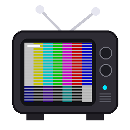

# Cathode

A retro IPTV player for the Steam Deck (and any Linux PC or Windows). Flip
through your M3U channels like it's 80s/90s cable TV — phosphor‑glow program
guide, CRT scanlines, channel‑change snow, on‑screen menus, and a UI that scales
from the Deck's screen to 1080p when docked.

**Version: 1.8b**

<br clear="left">

## Features

- **M3U playlists** and **XMLTV EPG** with a full program guide (with a live
  picture-in-picture video preview).
- **Retro cable‑TV UI** — info bar, CRT scanlines, vignette, and a fully
  controller/mouse/keyboard‑navigable on‑screen interface.
- **Channel‑change static** synced to real stream loading — opaque snow holds
  until the new channel's first frame is on screen, then fades to reveal it.
- **Themes & fonts** — 9 color themes, 5 retro fonts, and named **look
  profiles** (theme + font + scanline intensity), all switchable live.
- **Playlist/network profiles** — save several IPTV sources and switch between
  them from the menu.
- **On‑screen everything** — context menu (right‑click or a corner button) and
  an on‑screen keyboard for all text entry. No system dialogs; works in Game
  Mode and with the Steam Deck controller.
- **Auto resolution** — renders at mpv's real window size (handheld 1280×800,
  docked 1920×1080, 4:3, etc.).
- **Demo mode** — built‑in test‑pattern channels, no playlist needed.
- Runs on **Steam Deck/Linux** (Flatpak or system mpv) and **Windows**
  (self‑contained binary).

## How it works

Cathode doesn't embed a player. It launches **mpv** as a subprocess and drives
it over mpv's **JSON IPC** (a Unix socket on Linux, a named pipe on Windows).
mpv handles video/audio; the UI is rendered in Python (Pillow + numpy) and drawn
on top of the video with mpv's `overlay-add`. This needs no system packages on
SteamOS beyond a Flatpak.

---

## Install

### Windows — portable binary (no prerequisites)

Download **`cathode-windows-<ver>-portable.zip`**, extract it, and run
**`Cathode.exe`**. Python and mpv are bundled — nothing else to install. On
first run it shows an on‑screen keyboard to enter your playlist URL.

To rebuild it yourself: `pip install pyinstaller`, then
`python tools/build_windows.py`.

### Steam Deck (SteamOS)

In Desktop Mode, open a terminal in this folder:

```bash
chmod +x install.sh cathode.sh
./install.sh                 # installs Flatpak mpv (user scope) + venv + shortcut
./cathode.sh                 # or: ./cathode.sh --demo
```
The installer adds a **Cathode** shortcut (with icon) to your Desktop and app
menu. To play in Game Mode: set your playlist in the menu/config, then add the
Cathode shortcut as a Non‑Steam Game and map the controller (see Controls).

### Other Linux

```bash
sudo apt install mpv python3 python3-venv python3-pip   # or dnf / pacman
python3 -m venv .venv && source .venv/bin/activate
pip install -r requirements.txt
python main.py --demo
```

---

## Main menu

Cathode opens on a **main menu** (home screen) — logo, title, and four buttons:

- **New Playlist** — enter a name + M3U URL + optional XMLTV EPG URL, then start
  watching it.
- **Load Playlist** — pick one of your saved playlists (and your currently
  configured one) to start watching.
- **Options** — themes, fonts, the custom theme editor, display/monitor swap,
  and playlist management.
- **Exit** — quit.

Navigate with the mouse, arrows + Enter, or a gamepad (D‑pad + **A**). You can
return here any time from the context menu's **Main Menu** entry. (Demo mode
skips the menu and boots straight into the test channels.)

To **boot straight into your playlist** instead of the menu, set
`"main_menu_on_launch": false` in `config.json` — the home screen is still
available from the context menu. (The first run, before any playlist is set,
always opens the menu regardless of this flag.)

## First‑run setup

Choosing **New Playlist** (or **Load Playlist** with nothing saved yet) shows an
**on‑screen keyboard** to enter your M3U URL and optional XMLTV EPG URL, then
remembers them. If a playlist later fails to load, it re‑asks instead of
quitting. The keyboard works three ways: the on‑screen grid (mouse / arrows+Enter
/ controller), **typing directly on a physical keyboard** (including the numeric
keypad), and **Ctrl+V to paste** (Ctrl+C copies the field). Backspace and the
on‑screen `DEL` both delete — **hold Backspace** to clear a long string. Press
the grid's **DONE** key (or click it) to submit.

## Controls

| Input | Action |
|-------|--------|
| ↑ / ↓ | Channel up / down (guide: move selection) |
| ← / → | Volume down / up (guide: scroll time) — any volume change unmutes |
| `0`–`9` / numpad | Direct channel entry (digits show top‑right) |
| `G` | Program guide |
| `I` / `Tab` | Info bar |
| `M` | Mute |
| `F` | Add / remove the current (or highlighted) channel from **Favorites** |
| `C` / **Right‑click** / corner button | **Context menu** |
| `W` / double‑click | Toggle fullscreen |
| `Enter` / `Keypad Enter` | Select / press the highlighted item; **with the info bar up, opens the context menu** |
| `Backspace` | Delete a character (hold to repeat) / back out one menu level |
| `PgUp` / `PgDn` | Jump ±10 channels |
| `Q` | Quit |
| `Esc` | **Failsafe:** fully closes any dialog (re‑enabling hotkeys), else dismisses guide → info bar → exits fullscreen. Never quits. |

Both Enter keys behave the same (there's no separate "confirm"); use the on‑screen
keyboard's **DONE** key to submit text. With the context menu open, **clicking
outside the menu closes it**, and items activate only when the cursor is over
them. **Hold a navigation key** to repeat it — the highlight scrolls (and wraps
around) in menus, the on‑screen keyboard and the guide, and theme‑editor sliders
keep moving (stopping at their min/max). Channel and volume changes are not
repeated — they take a fresh press each time. While a menu or the on‑screen keyboard is open, the letter/number hotkeys
are disabled so navigation and typing can't trigger them — press **Esc** to close
the dialog and get them back.

### Gamepad / controller

Cathode reads a plugged‑in gamepad with its own built‑in reader (**XInput** on
Windows, the `/dev/input/js*` joystick interface on Linux) — so Xbox‑style pads
work on every build, including the SDL‑less Flatpak mpv. Plug it in and launch —
no configuration. On the Steam Deck in **Game Mode**, a Steam Input profile
mapping buttons to the keyboard keys above also works.

| Button | Action |
|--------|--------|
| **D‑pad / left stick** | Navigate (channels & volume while watching; selection in guide/menu) |
| **A** | Select / press highlighted key (types on the on‑screen keyboard) |
| **B** | Back — delete a char / leave a sub‑menu / close guide or info bar |
| **X** / **Start** | Program guide |
| **Y** | Info bar |
| **Back / View** | Context menu |
| **LB / RB** | Channel down / up |
| **LT / RT** | Volume down / up |
| **L3** (stick click) | Mute |
| **R3** (stick click) | Toggle fullscreen |

Disable it with `"gamepad": false` in `config.json` if it conflicts with another
input layer (e.g. a Steam Input profile that already emits keyboard keys).

### Context menu

Open it with **right‑click** or the small **menu button** that appears with the
info bar (top‑right). Navigate with mouse, arrows/Enter/Esc, or the controller.

```
Program Guide / Info Bar / Mute / Channel [^][v] / Volume [<][>] / Fullscreen
Themes >   - Color Theme > (themes... + Custom Theme...), Font >,
             Profiles >, Display >
Playlists > - switch network, Add playlist..., Delete playlist...
Main Menu / Quit
```

### Themes, fonts & look profiles

- **Themes:** Classic Blue, Amber CRT, Green Phosphor, VHS Magenta, Monochrome,
  Commodore 64, Red Alert, Synthwave, Ice.
- **Fonts:** VCR OSD Mono, PxPlus IBM VGA, Glass TTY VT220, Pixel Forge, DejaVu
  Sans Mono (all bundled on every platform), plus any fonts you add yourself.
- **Profiles** bundle theme + font + scanline intensity + CRT/vignette toggles +
  any custom palette. Built‑ins: Classic Blue, Amber Terminal, Green Phosphor,
  Synthwave, Commodore, Monochrome. Use **Save current as…** to make your own and
  **Delete** to remove them.

### Channel logos

Cathode pulls channel logos from your **XMLTV** `<icon>` URLs (falling back to the
M3U `tvg-logo`), fetched in the background and cached on disk. They appear in the
**info bar** (in the box, with the channel number moved beside the name) and in
the **guide** (above each row's number + name). Channels without a logo fall back
to showing the number.

The channel‑number color defaults to vibrant green but is editable per theme via
the **Channel #** sliders in the custom theme editor.

### Custom theme editor

**Themes ▸ Color Theme ▸ Custom Theme…** (always the last entry in the Color
Theme list) opens an editor for building your own look:

- **RGB sliders** for the five core OSD colors — Background, Accent (borders /
  highlights), Highlight, Text, and **Channel #** (the channel‑number color).
  Changes preview live.
- **Scanline Intensity** slider, plus **CRT Scanlines** and **Vignette** on/off
  toggles to dial the retro effects all the way down (or off).
- **Save Current Theme** overwrites the currently‑selected theme's colors,
  keeping its name. **Save As New Theme** prompts for a name and adds it to the
  Color Theme menu (new themes appear at the bottom, above **Custom Theme…**).
  **Reset to Default** restores the stock palette.
- **Close** (the row, or the **✕** button in the top‑right) exits — and if you
  haven't saved, your changes are **discarded and the previous theme restored**.

Adjust with arrows/Enter (left/right changes a value, up/down moves rows) or with
the mouse — click a slider to set it by position, click a toggle to flip it.

### Favorites & guide categories

The program guide has a **category selector** (◄ All ►) at the top‑right of its
info panel — press **Up** past the top channel to focus it, then **Left/Right**
to cycle categories. Categories are pulled from your **XMLTV** genres (falling
back to the M3U group), plus **All** and **Favorites**. The selector remembers
its position for the session and resets to **All** on the next launch.

Press **`F`** (or use the context‑menu entry) to **add/remove the current or
highlighted channel from Favorites** — a brief on‑screen toast confirms it.
Favorites persist in `config.json` and show up as their own category.

### Adding your own fonts

Drop any `.ttf` or `.otf` file into the **`assets/fonts/`** folder (next to the
app — on the Windows portable build it's `assets\fonts\` beside `cathode.exe`).
It appears automatically in **Themes ▸ Font**, labelled after its filename
(e.g. `My_Cool_Font.ttf` → "My Cool Font"). Monospace/pixel fonts look best.
No config edit or restart of the build is needed — just relaunch the app.

### Swapping monitors

**Themes ▸ Display** lists the connected monitors; pick one to move the Cathode
window there. The window targets that screen in both windowed and fullscreen
modes, and the aspect ratio + OSD automatically rescale to the new monitor's
resolution. (Single‑monitor systems show "no monitors detected".)

### Playlists / networks

Save multiple IPTV sources under **Playlists** and switch instantly (it reloads
channels + guide and retunes). Add new ones (name + M3U + XMLTV via the on‑screen
keyboard) or delete them. Stored in `config.json`.

---

## Autostart (always‑on PC)

Install a systemd **user** service so Cathode launches with your desktop session
and restarts on crash:

```bash
chmod +x install-service.sh && ./install-service.sh
systemctl --user start cathode.service
journalctl --user -u cathode.service -f   # logs
```
Enable desktop auto‑login for an unattended boot‑to‑Cathode box.

## Configuration

`~/.config/cathode/config.json` (Windows: `%USERPROFILE%\.config\cathode\`).
Created/updated automatically; edit while the app is closed.

| Key | Meaning |
|-----|---------|
| `playlist_url`, `epg_url` | Active M3U / XMLTV (URL or file path) |
| `playlists` | Saved networks: `[{name, playlist_url, epg_url}, …]` |
| `profiles` | Saved looks: `{name: {theme, font, scanline_alpha, crt, vignette, custom_palette}}` |
| `theme`, `font` | Active theme name / font key |
| `custom_themes` | User themes shown in the Color Theme menu: `{name: {bg, accent, accent2, text, chnum, scanline, crt, vignette}}` |
| `favorites` | Favorite channel numbers (the Favorites guide category) |
| `volume`, `muted`, `last_channel` | Playback state |
| `scanline_alpha` | CRT scanline strength (0–255) |
| `crt_enabled`, `vignette_enabled` | CRT scanline / vignette effect toggles |
| `gamepad` | Native (XInput/SDL) gamepad control on/off |
| `nav_repeat_delay`, `nav_repeat_rate` | Held‑key repeat delay (ms) / rate (per sec) |
| `main_menu_on_launch` | Show the home screen on launch (`false` = boot into the playlist) |
| `guide_hours` | Hours shown across the guide |
| `reveal_duration`, `tune_timeout` | Channel‑change fade / stall timeout |
| `osd_timeout`, `osd_timeout_info` | Info‑bar durations |
| `mpv_path` | Explicit path to mpv (when not on PATH) |
| `mpv_extra_args` | Extra raw mpv args, e.g. `["--hwdec=no"]` |
| `user_agent` | HTTP user‑agent for playlist/EPG/streams |

### Command‑line options

```
--playlist/-p, --epg/-e   M3U / XMLTV URL or file
--demo                    Built‑in test channels (no playlist needed)
--windowed/-w, --fullscreen/-f
--width / --height        Override resolution (auto‑detected otherwise)
--mpv  auto|flatpak|system
--channel N               Start on a channel number
--config/-c FILE          Config path
```

---

## Troubleshooting

- **`ModuleNotFoundError: PIL/numpy`** — venv not active; run the installer or
  `source .venv/bin/activate`.
- **mpv not found (Windows)** — install real mpv (`mpv --version` must work) or
  set `mpv_path`. Note: mpv.net is a different app.
- **No video in Game Mode (works in Desktop)** — gamescope quirk. Read
  `~/.cache/cathode/mpv.log` (Windows: `%LOCALAPPDATA%\cathode\mpv.log`) and try
  `{"mpv_extra_args": ["--gpu-context=wayland"]}`, `["--hwdec=no"]`, or
  `["--vo=gpu-next"]`.
- **Nothing in the guide** — channels' `tvg-id`s must match the XMLTV ids
  (a fuzzy name match is attempted as a fallback).

## Project layout

```
main.py              entry point
cathode/
  app.py             wiring, input handling, menu/profiles/playlists
  player.py          drives mpv over JSON IPC
  ipc.py             platform transports (unix socket / windows named pipe)
  playlist.py epg.py config.py demo.py
  ui/
    renderer.py      compositing + channel-change state machine
    osd.py guide.py menu.py osk.py effects.py theme.py
    mainmenu.py      home screen (logo + New/Load/Options/Exit)
    editor.py        custom theme editor (color sliders + CRT/vignette)
assets/  fonts + icon       tools/  build + preview + icon scripts
install.sh  install-service.sh  make-shortcut.sh  cathode.sh   (Linux)
install-windows.ps1  cathode.bat  tools/build_windows.py        (Windows)
```

## Status

**1.8b.** Playback, the picture-in-picture program guide with categories & favorites, themes/fonts/profiles, the custom
theme editor, monitor swapping, playlist profiles, native gamepad control, the
synced channel‑change static, the context menu + on‑screen keyboard, and
Windows/Linux builds are all in. The Python/UI layers are verified by
`tools/preview.py` and unit checks; live mpv input (gamepad, mouse buttons, the
on‑screen keyboard feel) and multi‑monitor moves are best confirmed on real
hardware.
