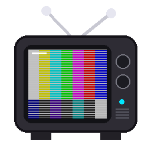
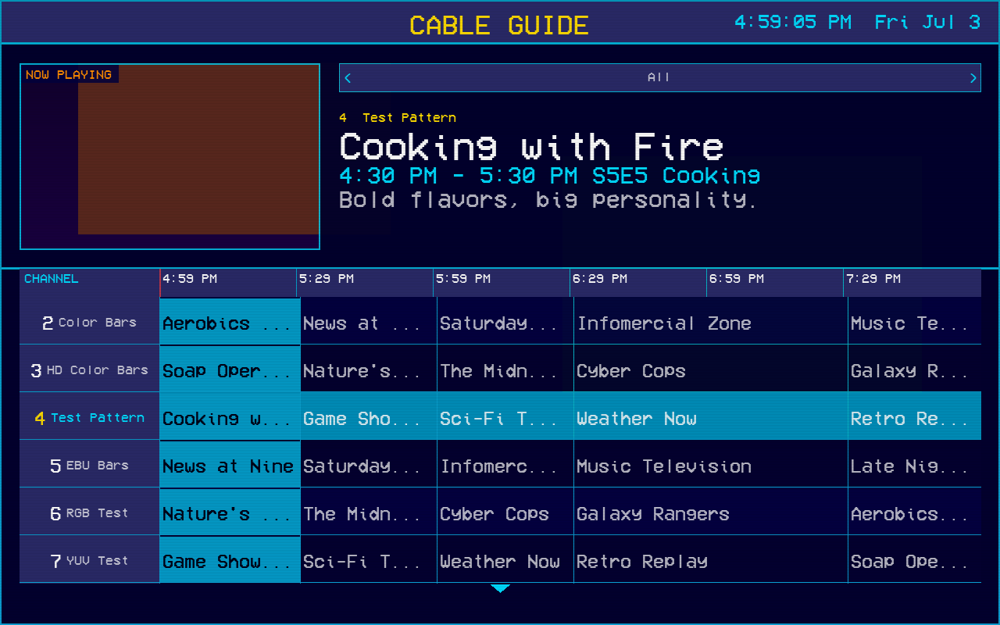
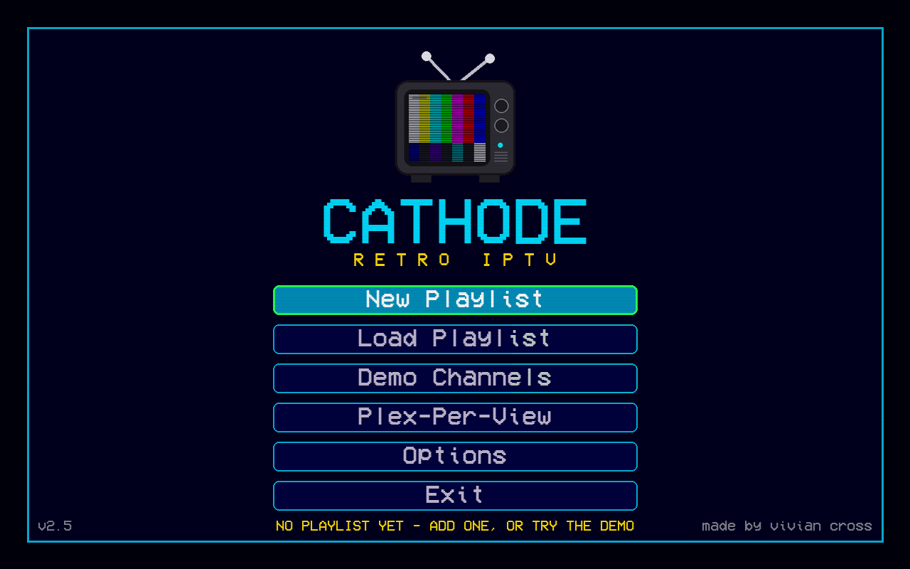
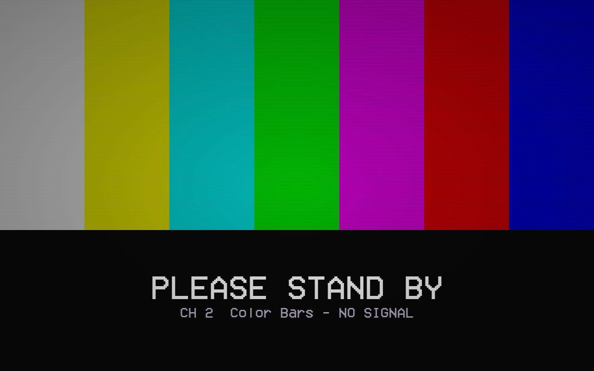
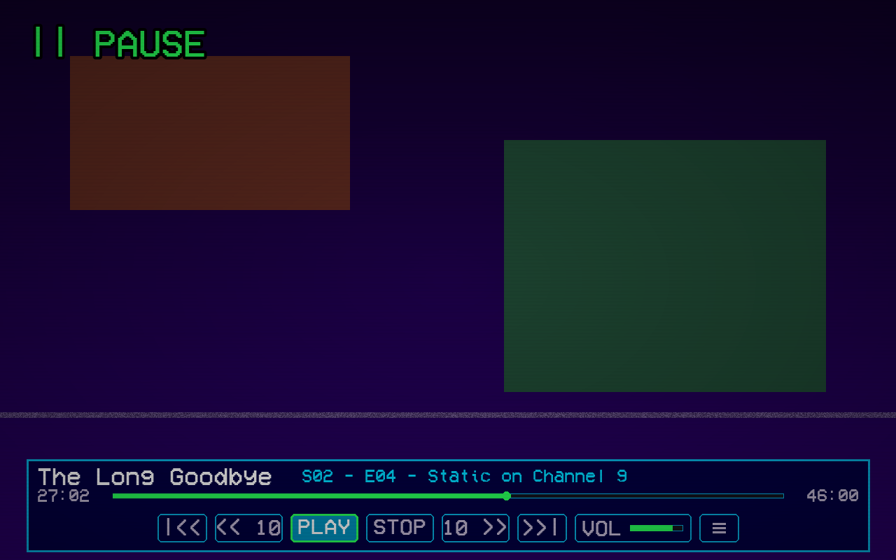
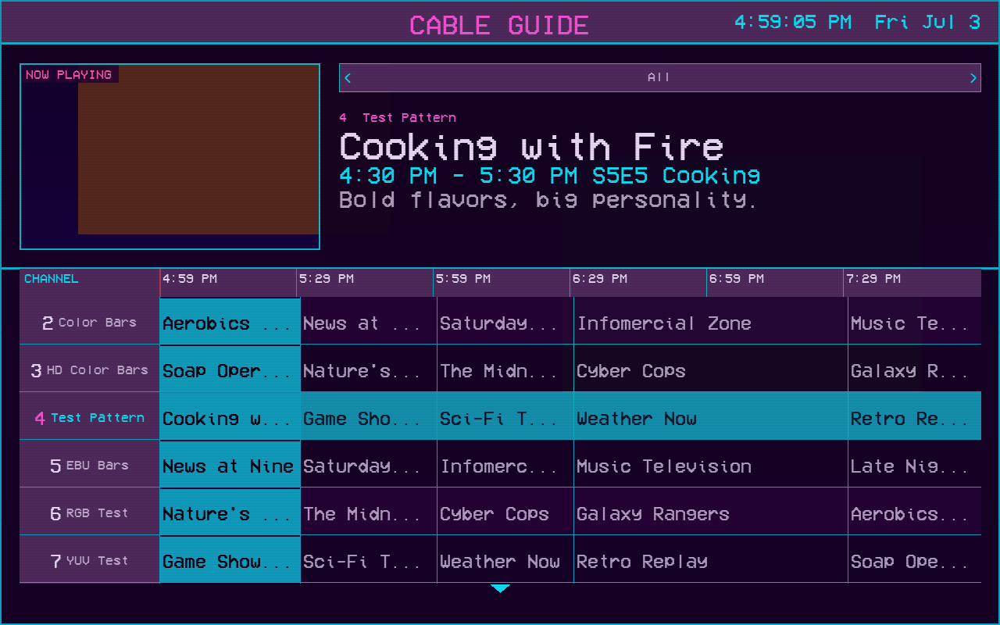

# Cathode

A retro IPTV player. It plays your M3U channels like old cable TV: a phosphor-glow
program guide, CRT scanlines, channel-change static, and on-screen menus you can
drive with a keyboard, a mouse, or a game controller. It runs on the Steam Deck,
Linux, Windows, and macOS, and renders at the window's real size, so it looks
right on the Deck's screen and on a docked 1080p TV.

**Version 3.1**

<br clear="left">

## Screenshots

| The cable guide | Home screen (first run) |
|---|---|
|  |  |

| A dead channel | Plex-Per-View, paused |
|---|---|
|  |  |

Themes restyle everything — the same guide in **vhs**:



## How it works

Cathode doesn't decode video itself. It runs **mpv** as a separate process and
talks to it over mpv's JSON IPC (a socket on Linux/macOS, a named pipe on
Windows). mpv handles video and audio. Cathode draws the interface in Python
with Pillow and paints it over the video with mpv's `overlay-add`. Running mpv
as its own process is also why the Flatpak mpv works on the Deck with no special
build.

## Features

- **Live TV from M3U + XMLTV** — a full program guide with a live
  picture-in-picture preview, channel logos, favorites, and categories pulled
  from your guide data.
- **Plex-Per-View** — sign in to your Plex server and browse, search, and watch
  your library on demand, including Continue Watching, your watchlist, an
  editable play queue, and Skip Intro / Skip Credits. See its own section below.
- **DVR** — download a plex title to the device and watch it locally, even offline.
- **Retro interface** — info bar, program guide, CRT scanlines, vignette, and
  channel-change static that holds until the new stream's first frame is ready.
  Dead channels get a "PLEASE STAND BY" test-bar card instead of a black
  screen, and an idle home screen or guide turns into a bouncing-logo
  screensaver after five minutes.
- **Themes and fonts** — 9 color themes, 6 bundled fonts, a custom theme editor,
  and saved profiles. Drop your own font into `assets/fonts/` and it appears in
  the menu.
- **Weather strip** — current conditions, temperature, city, humidity, and rain
  chance in the guide header, from wttr.in. No API key.
- **Full on-screen control** — every action has an on-screen control, so it
  works with a mouse alone and in Steam Deck Game Mode with no desktop dialogs.
- **Update check** — checks GitHub for a newer release and downloads it; see
  Updating below.
- **Demo mode** — built-in test-pattern channels, so you can try it with no
  playlist. With nothing configured, the home screen offers them directly.

## Install

The Windows download is self-contained. The Steam Deck, Linux, and macOS
download runs from source and uses a one-time setup script that installs what it
needs. First launch runs a short three-step setup — pick a color theme (live
preview), add your M3U playlist on the on-screen keyboard, sign in to Plex —
and every step is skippable: skip everything and you land in the built-in demo
channels. It's rerunnable later from **Options ▸ Setup Wizard**, and the home
screen keeps a **Demo Channels** button until a playlist is configured.

### Windows

1. Download the Windows zip (`cathode-windows-…-portable.zip`).
2. Right-click it and choose **Extract All** into any folder.
3. Open that folder and run **`Cathode.exe`**.

Python and mpv are bundled, so there's nothing else to install. (If Windows
SmartScreen warns about an unknown publisher, choose **More info → Run anyway**.)

### Steam Deck

1. Switch to **Desktop Mode**.
2. Download the `cathode-linux-macos-…` zip and extract it (double-click →
   **Extract**).
3. Open the extracted folder, right-click an empty area, and choose **Open
   Terminal Here**.
4. Run these three lines (press Enter after each):

   ```bash
   chmod +x install.sh cathode.sh
   ./install.sh
   ./cathode.sh
   ```

`install.sh` installs mpv (Flatpak, just for your user), sets up a private Python
environment, and adds a **Cathode** shortcut to your application menu. You only
run `install.sh` once; after that, launch from the shortcut or with `./cathode.sh`.
To try it before adding a playlist, run `./cathode.sh --demo`.

For **Game Mode**: finish setup in Desktop Mode, then in Game Mode add Cathode as
a **non-Steam game** and apply a controller layout.

### Linux

Same steps as the Steam Deck: extract the `cathode-linux-macos-…` zip, open a
terminal in that folder, then `chmod +x install.sh cathode.sh`, `./install.sh`,
`./cathode.sh`. The installer uses the Flatpak mpv; if you'd rather use your
distro's package (`sudo apt install mpv`, or `dnf`/`pacman`), install it first
and Cathode will find it.

### macOS

1. Download the `cathode-linux-macos-…` zip and unzip it.
2. Open **Terminal**, then `cd` into the unzipped folder.
3. Run:

   ```bash
   chmod +x install-macos.sh cathode.sh
   ./install-macos.sh
   ./cathode.sh
   ```

`install-macos.sh` installs mpv with Homebrew and sets up a private Python
environment. `./cathode.sh --demo` works here too.

## Using it

Cathode opens on a home screen with **New Playlist**, **Load Playlist**,
**Plex-Per-View**, **Options**, and **Exit**. New Playlist asks for a name, an
M3U URL, and an optional XMLTV URL. Demo mode skips straight to the test
channels.

Text fields use an on-screen keyboard that also takes real typing and Ctrl+V
paste. The bumpers (LB/RB) move the text cursor, and you can click the field to
place it. Press DONE to submit.

To boot straight into your last playlist, set `"main_menu_on_launch": false` in
the config file. The home screen is still reachable from the context menu.

### Controls

| Key | Action |
|-----|--------|
| Up / Down | Channel up / down (in the guide, move the selection) |
| Left / Right | Volume down / up (in the guide, scroll through time) |
| 0-9 | Type a channel number |
| G | Program guide |
| I or Tab | Info bar |
| M | Mute |
| F | Favorite the current or highlighted channel |
| Enter | Select the highlighted item |
| Backspace | Delete a character, or go back one level |
| Left-click | Press the on-screen control under the cursor |
| Right-click | Back out of a menu or list; opens the context menu while watching |
| W or double-click | Fullscreen |
| PgUp / PgDn | Jump 10 channels |
| Q | Quit |
| Esc | Close whatever's open; never quits |

Hold a navigation key to repeat it. While a menu or the keyboard is open, letter
and number shortcuts are off until you close it.

### Game controller

A controller works on every build with no setup (XInput on Windows,
`/dev/input/js*` on Linux, IOKit HID on macOS), and is picked back up if you
unplug and reconnect it. Turn it off with `"gamepad": false`. These are the
defaults; remap them under **Options > Gamepad Buttons**.

| Button | Action |
|--------|--------|
| D-pad / left stick | Navigate |
| A | Select |
| B | Back |
| X | Program guide |
| Y | Info bar |
| Back / View | Context menu |
| LB / RB | Channel down / up (previous / next episode during Plex playback; move the text cursor when the keyboard is open) |
| LT / RT | Volume down / up (jump 10 seconds during Plex playback) |
| L3 | Mute |
| R3 | Cycle video aspect ratio |

## Plex-Per-View

Pick **Plex-Per-View** from the home screen. The first time, it shows a code to
enter at plex.tv/link; after that it stays signed in. If your account has Plex
Home users, it asks who's watching, and prompts for a PIN on protected users. If
you have more than one server (owned or shared), pick which one under
**Options > Plex > Server**.

The library screen has:

- **Search** your libraries (movies, shows, episodes).
- **Continue Watching** — your in-progress items and next-up episodes.
- **My Watchlist**.
- Your **Movie, TV, and Other Videos** libraries, browsable by genre or folder,
  and sortable by title, release date, date added, year, or rating. Each library
  remembers the sort you left it on.

Libraries can be shown as a list or as a **poster wall** — a grid of artwork,
with a resume bar on anything you're part way through. Switch between them under
**Options ▸ View**; the choice sticks. The list is the default, and stays the
better of the two for episodes, where the titles carry the information and the
art is one repeated frame.

Selecting a title opens a detail page with poster, summary, and resume point.
From there you can play a movie or episode, play a whole show, shuffle it, or
add it to the play queue with **+ QUEUE** (on a series, that queues every
episode). Cathode reports your position back to the server, so progress and
watched state stay in sync with your other Plex apps.

The queue lives under **Play Queue** in the context menu, which lists what's
lined up and marks what's playing. Open any entry to play it now, move it up or
down, or drop it — and the whole queue can be cleared from the bottom of the
list. When one item finishes, the next one starts.

**DVR** on an item's detail page downloads it to this machine. The button
tracks the copy (`DVR 42%`, then `ON DVR`), and once anything is downloaded a
**DOWNLOADS** row appears in the library list. Press DVR on something you've
already got to keep or delete it.

Downloads are always the original file rather than a transcode: a transcode is
sized for the network it was requested on, and a download outlives that network.
One downloads at a time, and an interrupted one resumes where it stopped instead
of starting a four-gigabyte film again.

With the server unreachable, Plex-Per-View opens straight onto DOWNLOADS marked
**OFFLINE** rather than waiting out a connection timeout, and a downloaded copy
is played instead of the stream whenever one exists.

They're kept in `~/Videos/Cathode` (`~/Movies/Cathode` on macOS), following your
XDG videos directory on Linux where it's set. Set `download_dir` in the config
to put them somewhere else, like a bigger disk.

While something is playing, the on-screen control bar handles play/pause,
skip back/forward, previous/next, volume, and a timeline. The timeline is
select-then-scrub: press it to start scrubbing, press again (or back out) when
done. A **Skip Intro** / **Skip Credits** button appears on the bar during those
sections. Use the context menu for audio and subtitle tracks, subtitle
font, size, color, and background box, and the audio output device. Set
streaming quality (direct play or a transcode cap) under **Options > Plex**.

The browse screen has on-screen **Back** and **Menu** buttons, so the whole flow
works with a mouse. Your Plex token is sent to the server in a request header,
not in the video URL, so it stays out of mpv's log file.

## Options

Open the context menu (right-click while watching, the corner button, or `C`).
**Options** holds:

- **Themes** — color theme (with a custom theme editor), font, and saved
  profiles that bundle a theme, font, and CRT settings.
- **Weather** — set your zip and country; the guide header then shows local
  conditions.
- **Plex** — streaming quality, which libraries to show, server, and user.
- **Keyboard Shortcuts** and **Gamepad Buttons** — remap inputs.
- **Audio Device** — pick the audio output device.
- **Display** — fullscreen, monitor selection, and **Aspect Ratio** (Original,
  Stretch, 4:3, 16:9, 16:10; also on the controller's R3).
- **Check for Updates** — see below.

### Config file

The config file is at `~/.config/cathode/config.json` and is written
automatically. A few settings only live in the file:

- `main_menu_on_launch` — show the home screen on launch, or boot into the last
  playlist.
- `mpv_path` — full path to mpv if it isn't on PATH.
- `mpv_extra_args` — extra mpv flags, e.g. `["--hwdec=no"]`.
- `gamepad` — turn the controller reader on or off.
- `update_check` — check for a newer release on launch.
- `download_dir` — where the DVR keeps downloaded files. Blank picks the
  platform's videos folder.

## Updating

**Options > Check for Updates** asks GitHub for the latest release. If it's newer
than the running version, Cathode downloads the build for your platform (the
Windows portable zip on Windows, the source zip on the Deck, Linux, and macOS)
to `~/.cache/cathode/updates/`. It does not overwrite the running program: when
you quit, a small script installs the downloaded files, so the next launch is the
new version. Downloads are verified against the release's `.sha256` checksum
file when one is published. With `update_check` on, Cathode also checks quietly
on launch and tells you when an update is available.

## Building from source

PyInstaller can't cross-compile, so build on the OS you're targeting. Install
PyInstaller (`pip install pyinstaller`), then run the matching script:

```bash
python tools/build_windows.py   # cathode-windows-<ver>-portable.zip (bundles mpv)
python tools/build_linux.py     # cathode-linux-<ver>.tar.gz
python tools/build_macos.py     # cathode-macos-<ver>.zip (mpv via Homebrew)
python tools/build_source.py    # cathode-linux-macos-<ver>.zip (Deck/Linux/macOS from source)
```

Only the Windows build bundles mpv. The Linux and macOS builds expect mpv to be
installed on the machine.

## Troubleshooting

- **mpv not found (Windows)** — install real mpv so `mpv --version` works, or set
  `mpv_path`. mpv.net is a different program and won't work.
- **No video in Game Mode but it works on the desktop** — check
  `~/.cache/cathode/mpv.log`, then try `mpv_extra_args` like
  `["--gpu-context=wayland"]`, `["--hwdec=no"]`, or `["--vo=gpu-next"]`.
- **Guide is empty** — the channel `tvg-id`s have to match the XMLTV ids. Cathode
  also tries a fuzzy name match as a fallback.
- **ModuleNotFoundError for PIL or numpy** — the virtualenv isn't active. Run the
  installer, or `source .venv/bin/activate`.

## Project layout

```
main.py              entry point
cathode/
  app.py             input handling, menus, profiles, playlists
  player.py ipc.py   drives mpv over JSON IPC
  plex.py            Plex client (sign-in, browse, playback)
  downloads.py       the DVR: local copies of Plex items
  updater.py         GitHub release check + download
  playlist.py epg.py config.py weather.py demo.py logos.py gamepad.py
  ui/
    renderer.py      compositing and the channel-change state machine
    mainmenu.py guide.py osd.py menu.py osk.py editor.py theme.py effects.py
    ppv.py plexinfo.py plexosd.py    (Plex-Per-View screens)
assets/   fonts and icons
tools/    build and preview scripts
```

## License and credits

Cathode is free, non-commercial software under the **GNU General Public License
v3.0**. See [`LICENSE`](LICENSE).

Cathode is not affiliated with, endorsed by, or sponsored by Plex Inc. "Plex" is
a trademark of Plex Inc.; Cathode is an independent client for a Plex server you
already own.

The bundled fonts and the bundled mpv (Windows only) keep their own licenses.
Cathode runs mpv as its own process and never links it as a library. Details
and attributions are in [`THIRD_PARTY_NOTICES.md`](THIRD_PARTY_NOTICES.md) and
[`LICENSES/`](LICENSES/).
